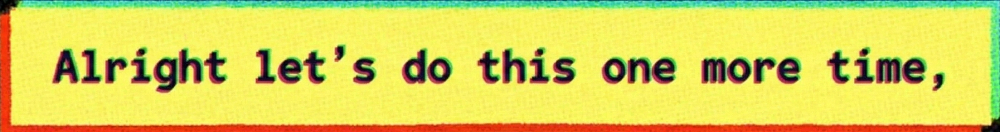

  

 

  

  
  &nbsp;&nbsp;&nbsp;&nbsp;"My name is [shreedharhegade](https://github.com/shreedharhegade) and I’m an Engineering Undergraduate Student studying Computers and AI and for the past one year I call myself **[JACK SPIDER](https://shreedharhegade.github.io)**.
   
   
  &nbsp;&nbsp;&nbsp;&nbsp;long Story short, I started my story with a little bit of code, learnt something about computers, wrote more code, did some dsa, joined some teams, did some work   and again did some more programming. Now I’m trying to be a good AI Engineer and a great problem solver and also write some more codes.” 

  

